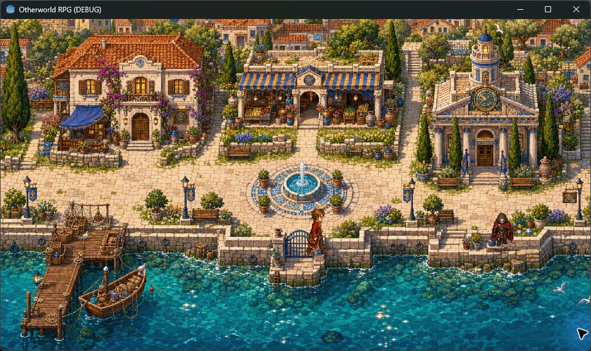
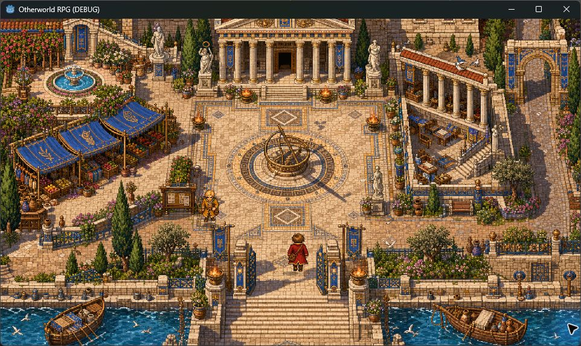
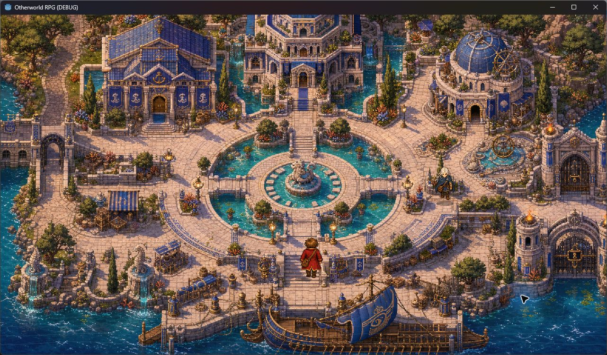

# Herdeiras de Atlântida

RPG 2D em Godot 4, com exploração top-down pixelada, escolhas narrativas, combate por turnos, equipamentos, magia e vínculos entre personagens.

## Build atual: Prólogo de Kallípolis e chegada a Nereu

Ivo chega a Kallípolis sem recursos nem respostas. O prólogo leva o jogador pela Pensão dos Degraus, o cais, a Ágora, o encontro com Ariane e a Cisterna Esquecida, onde a Marca das Moiras desperta. Ao concluir o prólogo, a rota marítima abre a primeira chegada jogável a Nereu.

## Estado visual

Inclui:

- quatro áreas ilustradas e jogáveis: Kallípolis, Pensão dos Degraus, Ágora e Nereu, além da Cisterna;
- movimento animado em quatro direções, colisões por ambiente e transições narrativas;
- diálogos com escolhas e afinidade com Ariane;
- primeiro encontro com Nerissa em Nereu, com escolhas, retrato e expressão;
- combate por turnos: atacar, defender, focar e Ressonância;
- baú de exploração que melhora arma e armadura;
- bolsa, relíquias, salvamento local e efeitos sonoros CC0;
- galeria de Vínculos com retratos neutros e envergonhados das seis heroínas.
- menu gráfico persistente com janela, sem bordas, tela cheia, cinco resoluções, VSync, filtro nítido/suave, sombras, reflexos, luz e brilho.

## Rodar

1. Abra o Godot 4.7 ou mais recente.
2. Importe `project.godot`.
3. Rode a cena principal com `F6` ou o projeto com `F5`.

## Controles

- `WASD` ou setas: mover e navegar opções.
- `E` ou espaço: interagir/confirmar.
- `I`: bolsa e equipamentos.
- `J`: Vínculos e galeria de heroínas.
- `F5`: salvar.
- `M`: mapa e objetivo.
- `Esc`: pausa e configurações gráficas.

## Resoluções

A composição usa uma base lógica 16:9 e se adapta sem deformação a `960×540`, `1280×720`, `1600×900`, `1920×1080` e `2560×1440`. Em telas menores, a janela preserva a proporção dentro da área útil; tela cheia utiliza toda a resolução disponível.

## Estrutura

- `assets/backgrounds/` e `assets/custom/`: cenários, mapas e sprites originais.
- `assets/portraits/`: retratos e expressões.
- `assets/audio/`: sons CC0 da Kenney.
- `assets/kenney/`: pack CC0 de tiles para prototipagem.
- `docs/`: roteiro, estado da build e licenças.
- `scenes/` e `scripts/`: implementação no Godot.

Consulte [docs/CURRENT_BUILD.md](docs/CURRENT_BUILD.md) para o estado detalhado e [docs/ASSET_LICENSES.md](docs/ASSET_LICENSES.md) para as origens dos assets.
