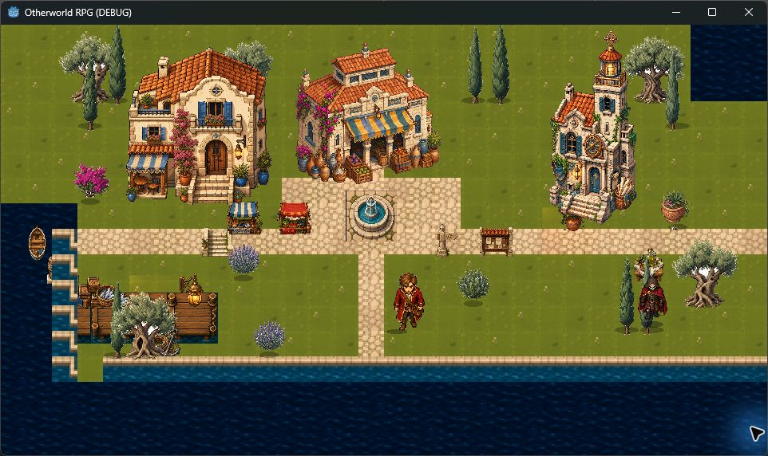
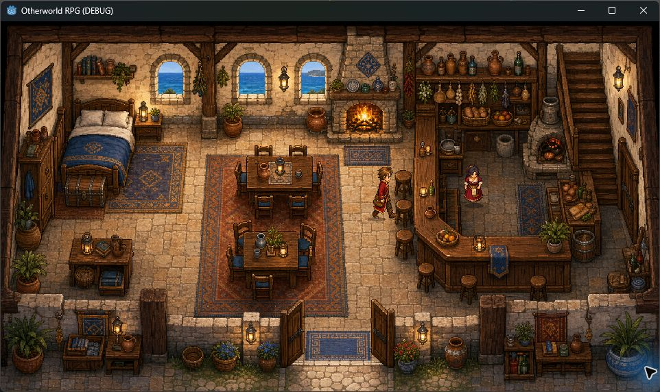

# Herdeiras de Atlântida

RPG 2D em Godot 4, com exploração top-down pixelada, escolhas narrativas, combate por turnos, equipamentos, magia e vínculos entre personagens.

## Build atual: Prólogo de Kallípolis

Ivo chega a Kallípolis sem recursos nem respostas. O prólogo leva o jogador pela Pensão dos Degraus, o cais, o encontro com Ariane e a Cisterna Esquecida, onde a Marca das Moiras desperta.

## Estado visual

Inclui:

- exploração em duas áreas jogáveis, colisão e objetivos;
- diálogos com escolhas e afinidade com Ariane;
- combate por turnos: atacar, defender, focar e Ressonância;
- baú de exploração que melhora arma e armadura;
- bolsa, relíquias, salvamento local e efeitos sonoros CC0;
- galeria de Vínculos com retratos neutros e envergonhados das seis heroínas.

## Rodar

1. Abra o Godot 4.7 ou mais recente.
2. Importe `project.godot`.
3. Rode a cena principal com `F6` ou o projeto com `F5`.

## Controles

- `WASD` ou setas: mover e navegar opções.
- `E` ou espaço: interagir/confirmar.
- `I`: bolsa e equipamentos.
- `J`: Vínculos e galeria de heroínas.
- `F5`: salvar.

## Estrutura

- `assets/backgrounds/`: cenários originais.
- `assets/portraits/`: retratos e expressões.
- `assets/audio/`: sons CC0 da Kenney.
- `assets/kenney/`: pack CC0 de tiles para prototipagem.
- `docs/`: roteiro, estado da build e licenças.
- `scenes/` e `scripts/`: implementação no Godot.

Consulte [docs/CURRENT_BUILD.md](docs/CURRENT_BUILD.md) para o estado detalhado e [docs/ASSET_LICENSES.md](docs/ASSET_LICENSES.md) para as origens dos assets.
