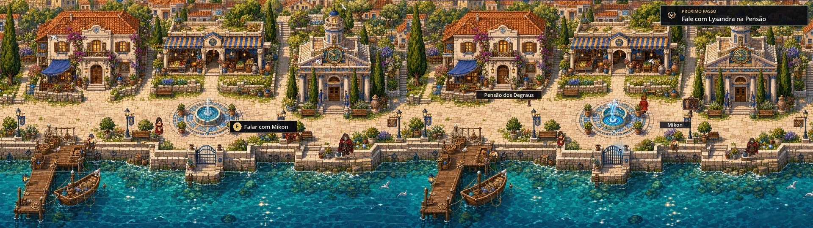

# Auditoria jogavel - 19 de julho de 2026

## Estado

`SAUDAVEL PARA O PROLOGO ATUAL`

Os bloqueadores relatados na exploracao inicial foram reproduzidos, corrigidos e cobertos por regressao automatizada. A validacao visual foi feita em execucao real do Godot, inclusive em `1920x1080`, e nao apenas pela leitura do codigo.

## Correcoes verificadas

| Problema observado | Correcao aplicada | Evidencia |
| --- | --- | --- |
| Passos com salto, recuo e pose errada | Velocidade continua, aceleracao/desaceleracao, varredura em subpassos, animacao por distancia e folha cardinal 4x4 | Movimento mantido nunca recua; quatro sentidos validados visualmente |
| Fonte e agua bloqueando caminhos invisiveis | Colisao eliptica alinhada ao pe da fonte, areas caminhaveis refeitas e deslizamento por eixo | Testes de contorno, pier e antitunelamento |
| Fonte e mar pareciam estaticos | Fonte de quatro frames, shader de refracao/caustica, espuma e brilhos ambientais | Fase da agua avanca em tempo real; camada `WaterPostFX` presente |
| Pensao expulsava o jogador ao entrar | Entrada e saida separadas por distancia segura e cooldown de transicao | Fluxo entrar, paginar dialogo, fechar e sair coberto por teste |
| Mikon invisivel e cidade sem vida | Celula de sprite valida, sete moradores com rotas de quatro pontos, pausas, direcao e falas | Mikon visivel no mapa e roster validado |
| Jogador nao sabia aonde ir | Objetivo compacto, marcador animado, placas ilustradas e prompts de proximidade | Pensao, Agora, personagens e ferry possuem alvos contextuais |
| Dialogo de Ariane travava na primeira fala | Confirmacao tratada uma vez por evento e paginas/decisao testadas | Primeiro dialogo chega a escolha e avanca para o Coletor |
| Aplicar resolucao/tela cheia nao confirmava | Menu orientado por evento, snapshot de configuracao, Aplicar/Cancelar explicitos | Alterar, cancelar e aplicar cobertos por regressao |
| Ferry e cidades podiam reutilizar o proprio gatilho | Spawns de retorno movidos para fora do raio de interacao | Agora -> Nereu -> Agora validado |
| Nereu ainda exibia a instrucao de tomar o ferry | Texto do objetivo agora considera a zona atual | Em Nereu, o tracker e o marcador apontam para Nerissa |

## Resultado tecnico

- Importacao e analise da cena no Godot 4.7.1: passou sem erro de script.
- Suite headless: `84 checks passed`, sem erro de script ou aviso de recurso retido.
- Resolucao visual testada: `1920x1080`, tela cheia, proporcao preservada.
- Agua em execucao: dois frames separados por `0,7 s` alteraram `47,1%` dos canais da regiao do mar acima do limiar de ruido, confirmando movimento real do shader e dos efeitos.
- Capturas atuais: [Kallipolis](screenshots/kallipolis-guided.jpg), [Pensao dos Degraus](screenshots/pension-guided.jpg), [Agora](screenshots/agora-guided.jpg) e [Nereu](screenshots/nereu-guided.jpg).

## Principios usados

- Movimento: velocidade, aceleracao, deslizamento e deteccao continua em pequenos subpassos.
- Orientacao: proximo objetivo sempre legivel, mas sem poluir todo o mapa com etiquetas permanentes.
- Interacao: prompt aparece apenas dentro do alcance real e corresponde a mesma distancia usada pela logica.
- Vida ambiental: moradores percorrem rotas, pausam, mudam de direcao e convivem com efeitos que continuam em movimento.
- Resolucao: base logica 16:9 escalada pelo Godot, com modo nitido ou suavizado selecionavel.

## Limite honesto do escopo

Esta auditoria certifica o prologo implementado e seus fluxos atuais. Ela nao significa que todos os capitulos, seis romances ou a campanha comercial completa ja estejam produzidos; esses continuam sendo conteudo posterior sobre uma base jogavel agora estabilizada.
